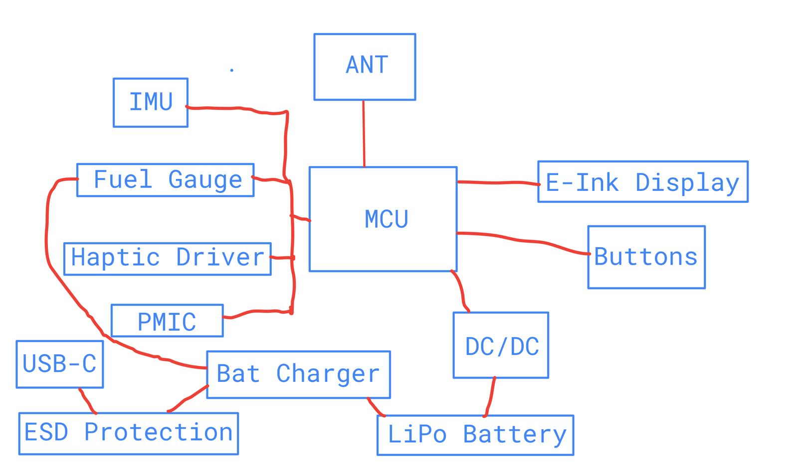
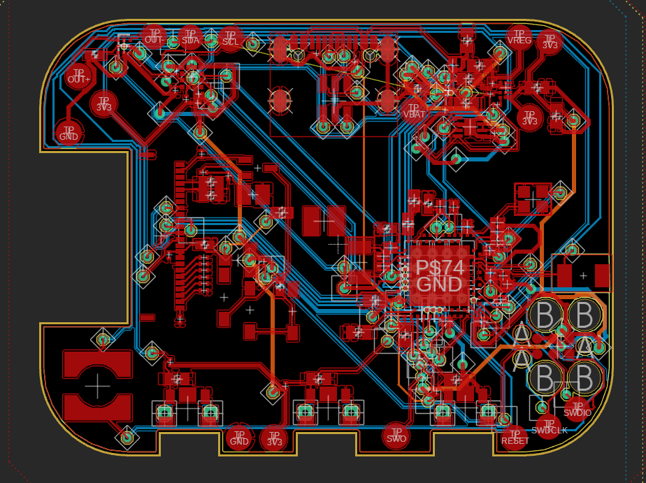
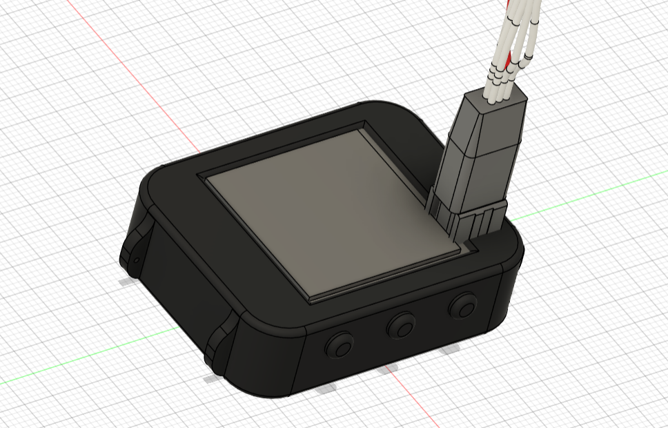

# InkTime

## 1. Schema bloc

---

## 2. Descriere hardware

Sistemul este construit în jurul microcontrolerului **nRF52840**, fiind optimizat pentru:
- consum redus de energie
- conectivitate stabilă
- vizibilitate excelentă în lumină puternică

Pentru afișare este utilizată tehnologia **E-Paper**, care consumă energie doar la actualizarea imaginii.

---

### 2.1 Nucleul sistemului (MCU)

- **Microcontroler:** Nordic nRF52840  
- **Comunicare:** Bluetooth + periferice prin I2C și SPI  
- **Radio:**  
  - Semnalul RF este filtrat și transmis către o antenă ceramică de 2.4GHz  
  - Zona PCB de sub antenă este decupată pentru a evita atenuarea semnalului  

---

### 2.2 Managementul energiei

- **Încărcare:** BQ25180 gestionează încărcarea bateriei LiPo prin USB-C  
- **Monitorizare:** MAX17048 măsoară nivelul bateriei (I2C)  
- **Reglare tensiune:** RT6160A (Buck-Boost) menține constant 3.3V  

---

### 2.3 Afișaj și feedback

- **Ecran:** E-Paper (SPI, consum minim)  
- **Driver ecran:** Circuit cu tranzistori și diode pentru tensiunile de refresh  
- **Feedback haptic:** DRV2605 controlează motorul de vibrații  

---

### 2.4 Senzori și protecție

- **IMU (BMA423):**
  - pedometru
  - detectare ridicare mână  

- **Protecție USB:** USBLC6-2 protejează împotriva descărcărilor electrostatice  

---

### 2.5 Consum estimativ

#### Sleep Mode

I_sleep = MCU + IMU + FuelGauge + DC/DC
= 1.5 + 7 + 23 + 2 ≈ 33.5 µA

#### Active Mode

I_active ≈ 5–12 mA

#### Consum mediu

I_mediu = ((I_active × 2 min) + (I_sleep × 58 min)) / 60
≈ 365 µA

#### Autonomie

Autonomie = 100 mAh / 365 µA ≈ 274 ore

---

## 3. Pin Mapping nRF52840

| Funcție | Semnal | Pin | Descriere |
|--------|--------|-----|----------|
| I2C SCL | I2C_SCL | P0.27 | Bus comun |
| I2C SDA | I2C_SDA | P0.26 | Bus comun |
| SPI SCK | EPD_SCK | P0.31 | Clock ecran |
| SPI MOSI | EPD_MOSI | P0.29 | Date ecran |
| EPD | EPD_BUSY | P0.05 | Status ecran |
| EPD | EPD_RST | P0.06 | Reset |
| EPD | EPD_DC | P0.08 | Data/Command |
| Buton | SW_UP | P0.11 | Navigare sus |
| Buton | SW_ENT | P0.12 | Select |
| Buton | SW_DN | P0.14 | Navigare jos |
| Haptic | EN_HAPTIC | P0.17 | Activare |
| IMU | IMU_INT1 | P0.19 | Interrupt |
| Debug | SWDIO | SWDIO | Programare |
| Debug | SWCLK | SWCLK | Clock |

---

---

## 4. Design

### 4.1 PCB

- Antena plasată pe margine, cu zonă fără cupru sub ea  
- PCB de **1.0 mm**, 4 layere:
  - GND
  - Power
  - Top
  - Bottom  

- Condensatori de decuplare (100nF) aproape de pini  
- Lățimi trasee:
  - Power: 0.3 mm  
  - Semnal: 0.15 mm  

#### Strategie rutare:
1. plasare componente
2. rutare semnale
3. rutare power
4. polygon pour + GND final

---

### 4.2 Carcasă și erori

- Butoanele și USB-C sunt aliniate cu carcasa  
- Erori acceptate:
  - **Dimension:** USB și butoane  
  - **ERC:** pini nefolosiți  
  - **DRC:** trasee/vias apropiate inevitabil  

---

## 5. BOM (Bill of Materials)

| Designator | Componentă | Descriere |
|-----------|-----------|----------|
| U1 | nRF52840 | MCU Bluetooth |
| U2 | BQ25180 | Charger LiPo |
| U3 | MAX17048 | Fuel Gauge |
| IC1 | RT6160A | Buck-Boost |
| IC2 | BMA423 | IMU |
| IC3 | DRV2605 | Haptic Driver |
| ANT1 | 2450AT18B100E | Antenă |
| J1 | USB-C | Conector |
| J2 | FPC | E-Paper |
| C_dec | 100nF | Decuplare |
| C_bulk | 10uF | Filtrare |
| R_pu | 4.7k | Pull-up |
| L_pwr | 1uH | Inductor |
| X_32k | 32.768kHz | Cristal |
| D_esd | USBLC6-2 | Protecție ESD |

---
